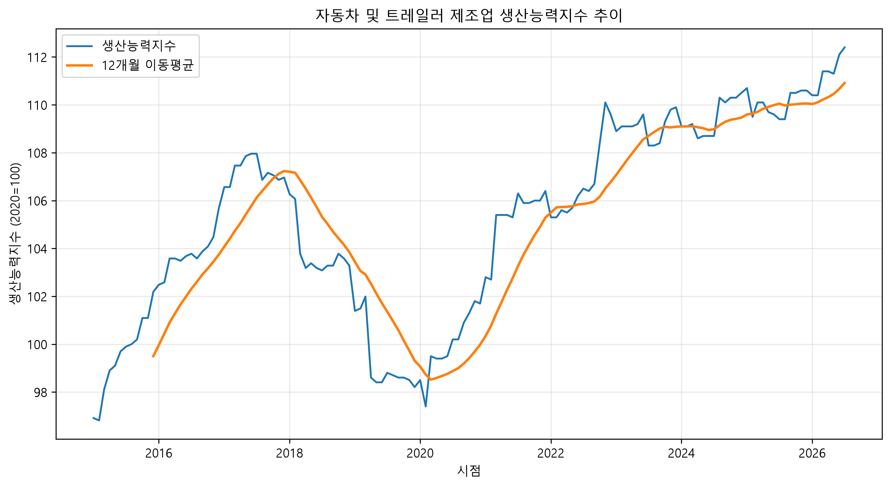
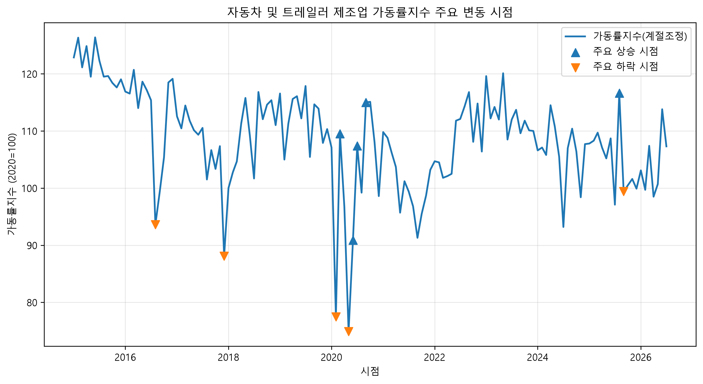
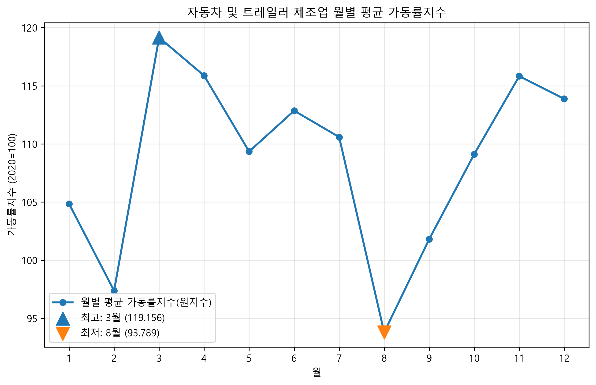
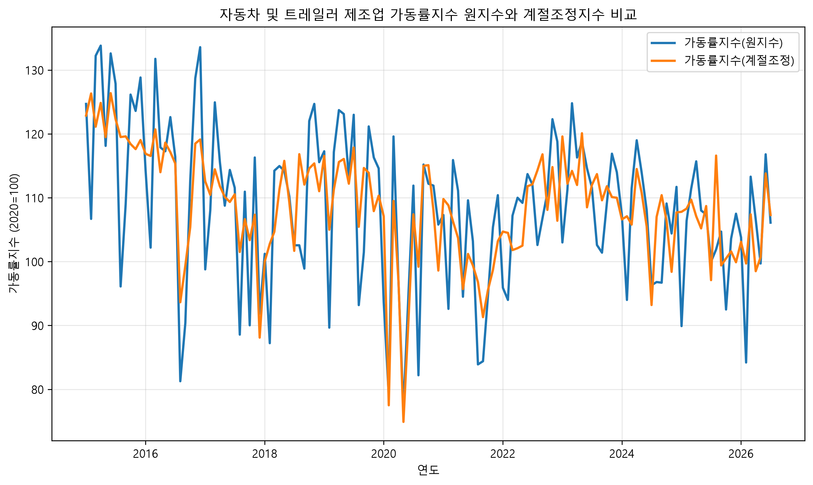

# 국내 자동차 제조업 생산활동 시계열 분석

## 1. 분석 목적

본 분석은 KOSIS의 자동차 제조업 생산능력지수와 가동률지수를 활용하여 2015년 1월부터 2026년 7월까지 국내 자동차 제조업의 생산활동 변화를 분석하는 것을 목적으로 한다.

생산능력의 장기 추세, 가동률의 주요 변동 시점, 월별 패턴 및 계절적 영향을 확인하고, 분석 결과를 바탕으로 자동차 제조업 생산활동의 특징과 로봇자동화 관점의 시사점을 살펴본다.

---

## 2. 분석 질문

본 분석에서는 다음 네 가지 질문을 중심으로 시계열 데이터를 분석하였다.

1. **자동차 제조업의 생산능력은 2015년부터 2026년 7월까지 어떻게 변화했는가?**
2. **자동차 제조업의 가동률은 어떤 시기에 크게 상승하거나 하락했는가?**
3. **자동차 제조업의 가동률에는 반복되는 월별 또는 계절적 패턴(계절성)이 존재하는가?**
4. **계절적 요인을 제거하면 자동차 제조업 가동률의 흐름은 어떻게 달라지는가?**

---

## 3. 데이터 설명

### 3-1. 데이터 출처 및 분석 범위

- **출처:** KOSIS 국가통계포털
- **분석 대상:** 자동차 및 트레일러 제조업
- **분석 기간:** 2015년 1월 ~ 2026년 7월
- **데이터 단위:** 월별(KOSIS 원자료가 월별 지수로 제공되며 장기 추세와 월별 계절성을 함께 확인하기 위해 월 단위를 유지하였다.)
- **데이터 수:** 139개월
- **분석 파일:** `data/automobile_manufacturing_indices_2015_2026.csv`

본 분석에서는 KOSIS 산업분류상 **자동차 및 트레일러 제조업**의 하위 세부 업종이 아닌 전체 업종 데이터를 사용하였다.
이후 리포트에서는 편의상 **자동차 제조업**으로 표기한다.

### 3-2. 주요 분석 지표

| 변수 | 설명 | 주요 활용 |
| :---: | :---: | :---: |
| `production_capacity_index` | 생산능력지수 | 생산능력의 장기 추세 분석 |
| `utilization_index_original` | 가동률지수 원지수 | 월별·계절적 패턴 분석 |
| `utilization_index_seasonally_adjusted` | 가동률지수 계절조정지수 | 주요 변동 시점 및 추세 분석 |

생산능력지수는 자동차 제조업의 생산능력이 장기적으로 어떻게 변화했는지 확인하는 데 사용하였다.

가동률지수는 분석 목적에 따라 원지수와 계절조정지수를 구분하여 사용하였다. 월별 계절성을 확인할 때는 계절적 특성이 포함된 원지수를 사용하고, 계절적 영향을 줄인 상태에서 가동률의 변화를 비교할 때는 계절조정지수를 사용하였다.

### 3-3. 2026년 데이터 처리 기준

2026년 데이터는 7월까지만 존재하는 **부분 연도 데이터**이다. 따라서 완결 연도와의 비교에서 발생할 수 있는 왜곡을 줄이기 위해 다음 기준을 적용하였다.

- 전체 장기 추세 분석에는 **2026년 7월까지 포함**
- 2026년을 이전 완결 연도의 연평균과 직접 비교하지 않음
- 최근 연도 비교는 **2025년 1-7월과 2026년 1-7월**의 동일 기간을 사용
- 월별 계절성 분석에는 **2015~2025년 완결 연도만 사용**

---

## 4. 데이터 품질 확인 및 전처리

데이터의 결측치, 중복 시점 및 월별 연속성을 확인하였다.

- 결측치: **0개**
- 중복 시점: **0개**
- 누락 월: **0개**
- 분석 기간 전체의 월별 연속성 확인

결측치와 중복이 확인되지 않아 별도의 보간이나 제거는 수행하지 않았다.

### 4-1. 이상치 처리 기준

급격한 상승·하락 값은 실제 생산활동의 변동을 반영할 가능성이 있으므로 임의로 삭제하거나 보정하지 않았다.

원자료를 유지한 상태에서 전월 대비 변화율과 연도별 표준편차를 이용하여 변동성이 큰 시점을 분석하였다.

---

## 5. 분석 방법

| 분석 방법 | 활용 목적 |
| :---: | :---: |
| **12개월 이동평균** | 생산능력지수의 단기 변동을 완화하고 장기 추세 확인 |
| **전월 대비 변화율** | 계절조정 가동률지수의 주요 상승·하락 시점 확인 |
| **연도별 표준편차** | 연도별 가동률 변동성 비교 |
| **월별 평균** | 2015–2025년 가동률 원지수의 월별 계절 패턴 확인 |
| **원지수·계절조정지수 차이** | 계절조정 전후의 차이가 큰 시점 확인 |

원지수와 계절조정지수의 차이는 다음과 같이 계산하였다.

`seasonal_gap = 가동률 원지수 - 가동률 계절조정지수`

---

## 6. 분석 결과 및 시각화

### Q1. 자동차 제조업의 생산능력은 2015년부터 2026년 7월까지 어떻게 변화했는가?

생산능력지수의 장기적인 변화를 확인하기 위해 월별 지수와 **12개월 이동평균**을 함께 비교하였다.

생산능력지수는 2015년 1월 **96.915**에서 2026년 7월 **112.400**으로 증가하여 전체 기간 기준 **15.98% 상승**하였다. 시계열상 하락과 회복 구간이 나타났으며, 최근에는 분석 초기보다 높은 수준을 보였다.

2026년은 7월까지의 부분 연도이므로 최근 변화는 동일 기간으로 비교하였다. 2025년 1-7월 평균은 **109.871**, 2026년 1-7월 평균은 **111.343**으로 전년 동일 기간 대비 **1.34% 상승**하였다.

---

### Q2. 자동차 제조업의 가동률은 어떤 시기에 크게 상승하거나 하락했는가?

월별 계절 요인의 영향을 줄인 **계절조정 가동률지수**를 사용하여 전월 대비 변화율을 계산하고 주요 상승·하락 시점을 확인하였다.

그래프에서는 전월 대비 변화가 큰 주요 상승 시점을 ▲, 주요 하락 시점을 ▼로 표시하였다. 분석 결과 가동률은 전체 기간 동안 일정하게 유지되지 않았으며, 일부 시점에서 큰 폭의 상승과 하락이 나타났다.

특히 2020년 2-6월에는 급격한 하락과 반등이 반복되었으며, 2025년 9월에도 비교적 큰 하락이 확인되었다. 또한 연도별 표준편차를 비교하여 시기별 가동률 변동성에도 차이가 있음을 확인하였다.

---

### Q3. 자동차 제조업의 가동률에는 반복되는 월별 또는 계절적 패턴(계절성)이 존재하는가?

월별 계절성을 확인하기 위해 **가동률 원지수**를 사용하였다. 2026년은 7월까지만 존재하는 부분 연도이므로 제외하고 **2015~2025년 완결 연도**를 기준으로 월별 평균을 계산하였다.

분석 결과 **3월의 평균 가동률이 119.156으로 가장 높았으며, 8월은 93.789로 가장 낮았다.** 최고 월과 최저 월의 차이는 **25.367**로 나타났다.

이를 통해 월별 평균 가동률이 동일하지 않고 월에 따라 차이가 나타나는 것을 확인하였다.

---

### Q4. 계절적 요인을 제거하면 자동차 제조업 가동률의 흐름은 어떻게 달라지는가?

가동률 **원지수와 계절조정지수**를 동일한 시계열에서 비교하여 계절조정 전후의 흐름을 확인하였다.

두 지수의 차이를 확인하기 위해 `seasonal_gap = 원지수 - 계절조정지수`를 계산하고 차이가 큰 시점도 함께 살펴보았다.

분석 결과 두 지수는 전반적으로 비슷한 흐름을 보였지만 일부 월에서는 차이가 크게 나타났다. 계절조정지수에서는 원지수에 나타나는 월별 변동의 일부가 조정되어 상대적으로 흐름을 비교하기 쉽게 나타났다.

---

## 7. 인사이트

### 7-1. 생산능력은 장기적으로 확대되었지만, 실제 가동 수준은 시기별로 다르게 움직였다.

- **관찰(Fact):** 생산능력지수는 2015년 1월 **96.915**에서 2026년 7월 **112.400**으로 증가하여 전체 기간 기준 **15.98% 상승**하였다. 또한 2025년 1-7월 평균 **109.871**에서 2026년 1-7월 평균 **111.343**으로 동일 기간 기준 **1.34% 상승**하였다. 반면 가동률지수는 분석기간 중 여러 차례 큰 폭의 상승과 하락을 반복하였다.

- **해석(Hypothesis):** 생산능력은 장기적으로 확대될 수 있지만 실제 설비의 가동 수준은 생산량, 수요, 수출환경, 공급망 상황 등 단기적인 외부 요인의 영향을 받을 수 있다. 따라서 생산능력 증가가 곧바로 높은 가동률로 이어진다고 보기는 어렵다.

- **행동(Action):** 생산능력과 실제 가동 수준을 함께 관리하기 위해 생산량, 수요, 수출액 등의 지표를 추가로 결합하여 분석할 필요가 있다. 자동화설비 운영에서도 최대 생산능력뿐 아니라 수요 변화에 따라 가동 수준을 조절할 수 있는 유연한 생산계획이 중요하다.

- - -

### 7-2. 자동차 제조업 가동률은 외부 충격이 발생한 시기에 큰 변동을 보였다.

- **관찰(Fact):** 계절조정 가동률지수의 전월 대비 변화율을 분석한 결과, 2020년에는 **2월 -27.64%, 3월 +41.29%, 5월 -22.54%, 6월 +21.36%**로 급격한 하락과 반등이 반복되었다. 또한 2020년 연간 가동률의 표준편차는 **13.297**로 분석기간 중 가장 높은 변동성을 나타냈다. 2025년에도 **9월 전월 대비 -14.75%**의 주요 하락이 확인되었다.

- **해석(Hypothesis):** 2020년에는 코로나19 확산으로 주요 수출국의 이동제한과 생산중단이 발생하면서 자동차 생산이 크게 감소하였다. 당시 제조업 평균가동률은 63.6%까지 하락했고 자동차 생산도 전월 대비 21.4% 감소한 것으로 보도되었다. 2025년에는 미국 관세 부담과 수출환경의 불확실성이 확대되면서 자동차 업종의 기업경기전망지수(BSI)가 전분기보다 16p 하락한 60을 기록하였다. 다만 BSI는 경기전망 지표이므로 2025년 가동률 하락의 직접적인 원인이라고 단정할 수는 없으며, 하락 시기와 대외 불확실성 확대 시점이 겹친다는 수준에서 해석하는 것이 적절하다.
([경향신문, 2020.06.30](https://www.khan.co.kr/article/202006302123015),[연합뉴스, 2020.06.30](https://www.yna.co.kr/view/AKR20200630024753002?input=1195m))
([파이낸셜뉴스, 2025.09.28](https://www.fnnews.com/news/202509281542170628))

- **행동(Action):** 가동률 급변의 원인을 보다 정확하게 파악하기 위해 자동차 생산량, 수출액, 판매량, 부품 공급망 지표 등을 함께 분석할 필요가 있다. 생산현장에서는 공급망 차질이나 수요 급변에 대응할 수 있도록 대체조달 체계, 생산계획 조정 및 자동화설비의 유연한 운영방안을 검토할 수 있다.

- - -

### 7-3. 자동차 제조업 가동률에는 월별 계절적 차이가 나타났다.

- **관찰(Fact):** 2015~2025년 완결 연도의 가동률 원지수를 월별로 비교한 결과, **3월 평균이 119.156으로 가장 높았고 8월 평균은 93.789로 가장 낮았다.** 최고 월과 최저 월의 차이는 **25.367**로 나타났다.

- **해석(Hypothesis):** 월별 가동률 차이는 자동차 생산계획, 휴가철, 조업일수, 수요 및 수출 일정 등 다양한 요인의 영향을 받을 가능성이 있다. 다만 현재 데이터는 가동률지수만 포함하고 있어 특정 요인을 계절성의 직접적인 원인으로 판단할 수는 없다.

- **행동(Action):** 향후 월별 생산량, 조업일수, 휴일 및 수출 데이터를 함께 분석하면 계절적 패턴의 원인을 보다 구체적으로 확인할 수 있다. 반복적으로 가동률이 낮아지는 시기가 확인된다면 해당 기간을 예방보전, 설비점검 또는 생산라인 개선 일정에 활용하는 방안도 검토할 수 있다.

- - -

### 7-4. 계절조정지수는 단기적인 월별 변동을 줄여 가동률의 흐름을 파악하는 데 유용했다.

- **관찰(Fact):** 가동률 원지수와 계절조정지수를 비교한 결과 두 지수는 전체적으로 비슷한 흐름을 보였지만 일부 월에서는 차이가 크게 나타났다. `seasonal_gap = 원지수 - 계절조정지수`를 계산한 결과에서도 특정 시기에 계절적 영향에 따른 차이가 확인되었다.

- **해석(Hypothesis):** 원지수에는 월별 반복 패턴이나 계절적 요인이 포함되어 있기 때문에 실제 추세와 계절적 변동이 함께 나타난다. 계절조정지수는 이러한 반복적 요인의 영향을 줄여 시계열의 기본적인 변화 방향을 비교하기 쉽게 만든다.

- **행동(Action):** 월별 현황이나 실제 생산 수준을 확인할 때는 원지수를 활용하고, 시기 간 추세나 급격한 변화 시점을 비교할 때는 계절조정지수를 함께 활용하는 것이 적절하다. 향후 생산계획이나 이상 변동 감지에서도 두 지표를 병행하면 단순 계절변동과 비정상적인 변화를 구분하는 데 도움이 될 수 있다.

---

## 8. 결론

2015년 1월부터 2026년 7월까지 자동차 제조업 생산활동을 분석한 결과, 생산능력은 장기적으로 분석 초기보다 높은 수준으로 확대된 반면 실제 가동률은 시기별로 큰 변동을 보였다.

또한 월별 가동률에는 반복적인 차이가 나타났으며, 원지수와 계절조정지수를 함께 비교함으로써 계절적 변동과 전체적인 흐름을 구분하여 살펴볼 수 있었다.

따라서 자동차 제조업의 생산활동은 단순한 장기 상승·하락만으로 판단하기보다 **생산능력, 단기 변동성, 계절성을 함께 고려하여 해석할 필요가 있다.**

---

## 9. 분석의 한계

### 9-1. 외부 변수 및 인과관계의 한계

생산능력지수와 가동률지수를 중심으로 분석하였기 때문에 생산량, 판매량, 수출, 설비투자 등 외부 변수를 직접 반영하지 못하였다.

따라서 특정 시점의 변화와 산업·경제 사건 사이의 직접적인 인과관계를 판단할 수 없으며, 인사이트에서 제시한 원인은 가능한 해석 가설로 보아야 한다.

### 9-2. 2026년 부분 연도 데이터

2026년 데이터는 7월까지만 존재하므로 완결 연도와 직접 비교하는 데 한계가 있다. 이에 동일 기간 비교와 완결 연도 기준 계절성 분석을 적용하였다.

### 9-3. 월별 데이터의 한계

월 단위 자료를 사용하므로 월 내부에서 발생한 단기적인 생산 변동은 확인할 수 없다. 보다 세밀한 분석을 위해서는 주별 또는 일별 데이터가 필요하다.

---

## 10. AI 사용 로그

본 과제 수행 과정에서 AI를 분석 보조 도구로 활용하였다.

### 사용 작업

- 분석 질문 구체화
- Python 데이터 전처리 및 시계열 분석 코드 작성 보조
- 이동평균, 변화율, 표준편차, 월별 집계 방법 검토
- 시각화 코드 작성 및 개선
- 분석 결과 해석 과정의 논리 점검
- 리포트 문장 및 구조 정리

### 사용 이유

- Python 및 Jupyter Notebook을 활용한 분석 과정의 학습 보조
- 코드 작성 시간 단축
- 다양한 분석 방법의 대안 탐색
- 분석 결과에서 관찰과 해석을 구분하기 위한 검토
- 보고서 구조 및 표현 개선

### 검증 방법

AI가 생성하거나 제안한 내용을 그대로 사용하지 않고 다음 과정을 통해 결과를 검증하였다.

- 원본 데이터의 결측치, 중복 및 월별 연속성 직접 확인
- 주요 통계값을 코드 실행 결과와 비교
- 그래프와 계산 결과의 일치 여부 확인
- 2026년 부분 연도 데이터 처리 기준 별도 검토
- `analysis.ipynb`에서 **Restart → Run All**을 수행하여 전체 코드 재현성 확인
- 분석 결과에서 데이터로 확인 가능한 관찰과 원인에 대한 가설을 구분하여 작성

최종적인 분석 결과와 해석은 실제 코드 실행 결과와 데이터에 근거하여 판단하였다.

---

## 11. 데이터 이용 시 주의사항

분석 데이터는 **KOSIS 국가통계포털** 자료를 과제 수행 목적으로 가공하였다.

재사용 또는 외부 배포 시에는 KOSIS의 자료 이용 조건과 출처 표기 기준을 확인해야 한다.
